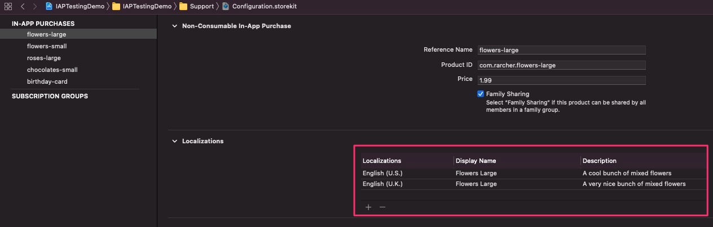

# Hello IAP World Example
A very minimal app to demo IAP testing in Xcode 12 and iOS14

This iOS 14/Xcode 12 app presents a minimal exploration of what's required to support in-app purchases. For a more detailed treatment of in-app purchases 
see [https://github.com/russell-archer/IAPTestingDemo](https://github.com/russell-archer/IAPTestingDemo).

- **Disclaimer**. The source code presented here is for educational purposes. You may freely reuse and amend this code for use in your own apps. 
However, you do so entirely at your own risk.

# Overview
There are a lot of pieces that fit together to enable you to support in-app purchases in your app:


The basic steps you need to take to support in-app purchases (IAP hereafter) in your app are as follows:


## Create an IAP helper class
Create a class or struct that will contain all your IAP-related code. For the sake of example we’ll refer to this as the **`IAPHelper`** code.

## Define your ProductIds
Define a set of Strings that hold **ProductIds** for the products you want to sell. ProductIds are generally in reverse domain form (“com.your-company.your-product”). 

For example, **`com.rarcher.flowers-large`**. These ids will match the product ids you define in App Store Connect.

## Add your `IAPHelper` to the Payment Queue
To receive notifications from the App Store (when payments are successful, fail, are restored, etc.) add your IAPHelper to the StoreKit payment queue. This should be 
done as soon as possible in the app’s lifecycle. 

For example in **`application(_:didFinishLaunchingWithOptions:)`**, so that notifications from the App Store are not missed:

```swift
SKPaymentQueue.default().add(iapHelper)
```

## Request localized product information from the App Store
The **`SKProductsRequestDelegate`** method **`productsRequest(_:didReceive:)`** will be called asynchronously with a list of **`SKProduct`** objects. 
Note that you can’t simply use predefined product data because you need to display prices, etc. that are *localized* for each user.

## Present the localized product list to the user and handle purchases
When the user taps on “buy product” you should wrap the selected **`SKProduct`** in an **`SKPayment`** object, then add it to the **`SKPaymentQueue`**. 
The App Store will then send notifications to the **`SKPaymentTransactionObserver`** method **`paymentQueue(_:updatedTransactions)`** as the purchase 
progresses. Note that the App Store presents the user with all the required purchase prompts and confirmations.

## Process the App Store Receipt
The App Store will create a new **receipt** when a purchase has been made or restored. The receipt is available when the **`paymentQueue(_:updatedTransactions)`** 
method is called. This receipt, which is cryptographically signed and encrypted, contains a complete record of all the IAPs made by the user of your app.

The code discussed in the **Hello IAP World** example below provides a practical example of the above points.

# Xcode 12 Improvements


Immediately before Apple’s WWDC 2020 keynote event I tweeted that I was hoping for something “magical and unexpected”. I followed this up with 
“How about an update to StoreKit that makes it really easy to do on-device validation of App Store receipts”. 

Well, I didn’t get my wish with regard to receipt validation, but I certainly got something magical and unexpected related to StoreKit and in-app purchases!

Starting with Xcode 12, there’s a new local **`StoreKit`** test environment that allows you to do early testing of IAPs in the simulator and without having to set 
anything up in App Store Connect. You can define your products locally in a **`StoreKit` Configuration file**. Furthermore, you can view and delete transactions, 
issue refunds, and a whole lot more. There’s also a new **`StoreKitTest`** framework that enables you to do automated testing of IAPs. The **Hello IAP World** 
project below includes details on how to create and use a StoreKit configuration file.



These new features are a huge leap forward in terms of making testing substantially easier, quicker to setup, more flexible and less frustrating!

# Hello IAP World Example
The following example shows how to create a **very minimal IAP example** (the IAP equivalent of “Hello World”) that makes use of the new StoreKit testing 
features in Xcode 12.

Note that StoreKit testing requires **Xcode 12** and **iOS 14**.

Although this is a bare-bones example, the project does demonstrate most of the essential requirements for handling in-app purchases in an iOS app.


Note that this example project is missing some features a real-world app would be expected to support:

- The App Store receipt is not validated, nor is IAP data read from the receipt
- Purchases are not persisted. So, if the app’s closed and restarted no purchases are remembered
- There’s no way to restore previous purchases
- Deferred purchases aren’t supported
- Edge cases are not supported (refunds, entitlements being revoked, store front changes, purchasing IAPs directly from the app store, etc.)

For this example, we’ll assume you’re going to create a demo app from scratch using iOS 14 and Xcode 12. Here are the steps we'll go through:

- **Add the StoreKit Framework**
- **Create the StoreKit configuration file**
- **Add the in-app purchase capability**
- **Enable StoreKit Testing via the Project Scheme**
- **Add the StoreKit public certificate**
- **Minimal IAPHelper Code**

## Create the App
Create a new iOS app in Xcode named "HelloIAPWorld":


As we'll be creating the UI programmatically we need to remove the Storyboard.

Remove the name (“Main”) of the storyboard in **Targets > General > Deployment Info**:


Delete **Main.storyboard** and move it to the trash:


Open **Info.plist**, search for **Main** and then remove the **Storyboard Name** entry entirely:


Open **SceneDelegate.swift** and modify the **`scene(_:willConnectTo:options:)`** method as follows:

```swift
class SceneDelegate: UIResponder, UIWindowSceneDelegate {
    
    var window: UIWindow?

    func scene(_ scene: UIScene, willConnectTo session: UISceneSession, options connectionOptions: UIScene.ConnectionOptions) {
        // Use this method to optionally configure and attach the UIWindow `window` to the provided UIWindowScene `scene`.
        // If using a storyboard, the `window` property will automatically be initialized and attached to the scene.

        guard let windowScene = (scene as? UIWindowScene) else { return }  // Get the window scene
        window = UIWindow(frame: windowScene.coordinateSpace.bounds)  // Create a window
       
        if let w = window {
            w.windowScene = windowScene  // Assign the window scene to the window's window scene
            w.rootViewController = ViewController()  // Set the root view controller (to the default view controller)
            w.makeKeyAndVisible()  // Make the window visible
        }
    }
    :
}
```

## Add the StoreKit Framework
The first thing you need to do after creating your new app is to add the **StoreKit** framework. Select your app **Target** and the **General** tab, then add 
the **`StoreKit`** framework:


## Create the StoreKit configuration file
Now create a StoreKit configuration file. Select **File > New > File** and choose the **StoreKit Configuration File** template:


Choose a location in your project to save the file.

Open the StoreKit configuration file and click **+** to add an in-app purchase. For this example select the **Add Non-Consumable in-App Purchase** option:


You can now define your products in the StoreKit configuration file:

In this example I set the following fields:

- **Reference Name** 
A descriptive name for the product
- **Product ID** 
This the unique code used to identify an IAP product. This same ID will be used in App Store Connect when setting up in-app purchases for production. 
Note that Product ID is a string that, by convention, uses the format “com.developer.product”, although it can be anything you like
- **Price** 
A hard-coded price for the product. In production your app will request localized price (and other) information from the App Store

By default, the first localization is for the US store. However, you can add as many localizations as required:


Note that none of the data defined in the .storekit file is ever uploaded to App Store Connect. It’s only used when testing in-app purchases locally in Xcode.

## Add the in-app purchase capability
It’s easy to forget to do this! And you can successfully test in-app purchases *without* adding the IAP capability. However, you will receive the following error when 
attempting to archive a project in preparation for uploading it to the App Store:


Add the in-app purchase capability by selecting the app target and **Signing & Capabilities**, then click **+** **Capability** to add a capability:


## Enable StoreKit Testing via the Project Scheme
You now need to enable StoreKit testing in Xcode (it’s disabled by default).

Select **Product > Scheme > Edit Scheme**. Now select **Run** and the **Options** tab. You can now select your configuration file from the **StoreKit Configuration** list:


Should you wish to disable StoreKit testing then repeat the above steps and remove the StoreKit configuration file from the **StoreKit Configuration** list.

## Add the StoreKit public certificate
You need to add the StoreKit public test certificate to your project. This isn’t strictly necessary if you’re not going to be doing any receipt validation. 
However, we’ll include the details here for completeness.

StoreKit testing in Xcode generates *locally signed* receipts that your app must validate locally against the StoreKit test certificate. In production your app 
will include the **Apple Root Certificate** and use that when validating the App Store receipt.

In Xcode project navigator, select the StoreKit configuration file. Now select **Editor > Save Public Certificate**.

Choose a location in your project to save the file.

You now need to ensure your app uses the correct certificate in all environments. The easiest way to do this is to create a simple helper which returns the 
correct certificate name for the runtime environment:

```swift
/// Constants used in support of IAP operations.
public struct IAPConstants {

    /// The appropriate certificate to use for DEBUG and RELEASE builds.
    /// - Returns: Returns the appropriate certificate to use for 
        /// DEBUG and RELEASE builds.
    public static func Certificate() -> String {
        #if DEBUG
                // This is issued by StoreKit for local testing
        return "StoreKitTestCertificate"  
        #else
                // For release with the real App Store
        return "AppleIncRootCertificate"  
        #endif
    }
}
```

## Minimal IAPHelper Code
In this example we’ll put all IAP related code into a single **`IAPHelper`** class. We set this up as a singleton, ensuring there’s only ever a single instance of the class:

```swift
public class IAPHelper: NSObject  {
    
    /// Singleton access. Use IAPHelper.shared to access all IAPHelper 
        /// properties and methods.
    public static let shared: IAPHelper = IAPHelper()
   
    /// Private initializer prevents more than a single instance of this class 
        /// being created. See the public static 'shared' property. This helper 
        /// must be initialized as soon as possible in the app's lifecycle. 
        /// See application(_:didFinishLaunchingWithOptions:).
    private override init() {
        super.init()
        
        // Add ourselves to the payment queue so we get App Store 
                // notifications        
        SKPaymentQueue.default().add(self)  
    }
    :
    :
}
```

In **`AppDelegate`** we initialize **`IAPHelper`**:

```swift
class AppDelegate: UIResponder, UIApplicationDelegate {

    public var iapHelper: IAPHelper?
    
    func application(_
                application: UIApplication, 
                didFinishLaunchingWithOptions launchOptions: 
                [UIApplication.LaunchOptionsKey: Any]?) -> Bool {

        // Make sure the IAPHelper is initialized early in the app's lifecycle 
        // to ensure we don't miss any App Store notifications
        iapHelper = IAPHelper.shared
        return true
    }
```

Then in the initial **`ViewController`** we request a list of localized product information:

```swift
class ViewController: UIViewController {

    private let iap = IAPHelper.shared
    
    override func viewDidLoad() {
        :
        configureProducts()
    }
    
    private func configureProducts() {
        // Ask the App Store for a list of localized products
        iap.requestProductsFromAppStore { notification in
        
            if notification == .requestProductsDidFinish { 
                self.tableView.reloadData() 
            }
        }
    }
}
```

When the user wants to purchase a product we call **`IAPHelper.buyProduct(_:completion:)`** and handle the result in a closure:

```swift
extension ViewController: ProductCellDelegate {
    
    internal func requestBuyProduct(productId: ProductId) {
        guard let product = iap.getStoreProductFrom(id: productId) else { return }
        
        // Start the process to purchase the product
        iap.buyProduct(product) { notification in
            switch notification {
            case .purchaseAbortPurchaseInProgress: 
                print("Purchase aborted (another purchase being processed)")

            case .purchaseCompleted(productId: let pid): 
                print("Purchase completed for product \(pid)")

            case .purchaseCancelled(productId: let pid): 
                print("Purchase cancelled for product \(pid)")

            case .purchaseFailed(productId: let pid): 
                print("Purchase failed for product \(pid)")

            default: break
            }
            
            // Reload data for a success, cancel or failure
            self.tableView.reloadData()  
        }
    }
}
```

## Running the app
If you run the app you'll be able to tap on "buy" button and step through the purchase procedure:


While the app's running, click on the **Manage StoreKit Transactions** button in Xcode's console toolbar:


You'll see transactions for purchases you've made:


From the **Manage StoreKit Transaction** view you can select a transaction and then:

- **Approve** a transaction (if it's pending parental approval)
- **Decline** a transaction (if it's pending parental approval)
- Issue a **refund**
- **Resolve** transaction issues
- **Delete** a transaction

The ability to **delete** transactions is a huge boast to productivity! Previously, when working with App Store Connect sandbox accounts you could 
test purchase a product once. If you wanted to test purchasing the same product again you'd have to create a new sandbox account, complete with 
Apple ID, email, etc.

For a more detailed treatment of in-app purchases see [https://github.com/russell-archer/IAPTestingDemo](https://github.com/russell-archer/IAPTestingDemo).
